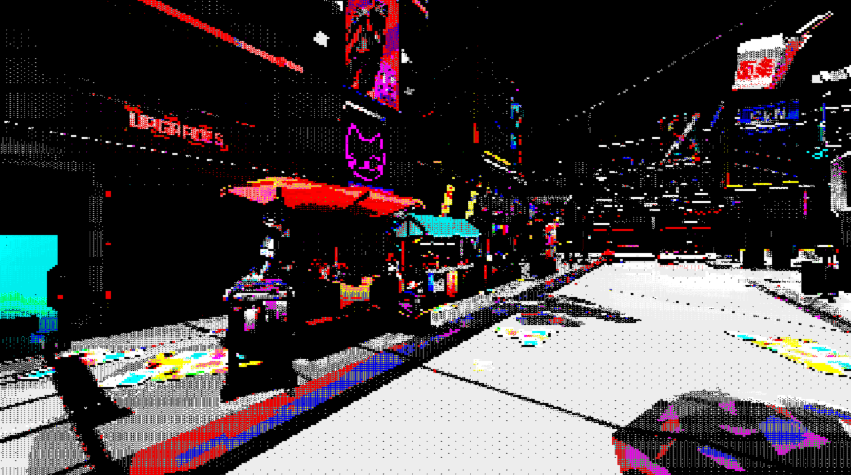

# Dithered pallete visual effect for Godot 4.2

Experimenting with a dithered pallete visual effect. My objective is to do a sort of ZX-Spectrum vibe visual effect.

The algorithm creates two volume textures, so for each point I have the endpoints of a line
in colorspace with valid ZX Spectrum colors, and a factor between them.

So, using the color on the color buffer I can figure out what two colors interpolation describe
best the color and how far along that interpolation I should go.

I then use a noise texture and a threshould factor to do some noise dithering.

This is also my first project in Godot, so I don't know how to do plenty of things.

## Version 1

## Version 2

- Added shader for spatial post-process (3d scenes)
- Added functions to generate a white noise texture

## Other experiments

While the effect might be cool, it probably requires assets done to exploit this, the tendency is to go to black a lot.
I've also added in the package some noise textures (blue noise and bayer) that provide a more ordered result.
I also added a "Use closest" flag that will just use the closest color in the given palette.

In the following images, we have the original image (with and without light boosting), the image with closest color (which has the more speccy-feel), with random noise and with a bayer noise texture.
In all of these, I had to boost the intensity of the light to get decent results with the dithering.

For fun, I also tried the effect with a Gameboy color palette, with the closest mode and no dithering.

Dithering in noisy images just adds to the confusion:

## Version 3

I did one more experiment, and I believe this is the best one yet. It requires art to be done for this style (simpler shapes, a lot of light), but the results are quite interesting.

The algorithm/shader is the same, the way I build the volume textures is slightly different.
Now, I convert the colors to HSV and I try to match them through distance in hue (unless the colour has low saturation, since greys aren't affected by color that much, in that case I do a match by brightness with just the greys). The first volume texture is that saturated/bright colour. The second one if the color black to create a gradient with the dithering, with the alpha factor describing how "dark" the colour is (so how much dithering it should use in that case).

## Licenses

- All source code by Diogo de Andrade is licensed under the [MIT] license.
- Sponza model from the [glTF-Sample-Assest repo].
- Some models in scene main3d_2 are not made available in the repo, since they are from [Sinty Studios] ([SciFi City]) and can't be distributed - just referencing them because some of the screenshots use them.
- All remaining art by Diogo de Andrade, available throught the [CC0] license.

## Metadata

- Autor: [Diogo Andrade]

[Diogo Andrade]:https://github.com/DiogoDeAndrade
[glTF-Sample-Assest repo]:https://github.com/KhronosGroup/glTF-Sample-Assets
[Sinty Studios]:https://www.syntystudios.com/
[SciFi City]:https://syntystore.com/products/polygon-sci-fi-city
[CC0]:https://creativecommons.org/publicdomain/zero/1.0/
[CC-BY 3.0]:https://creativecommons.org/licenses/by/3.0/
[MIT]:LICENSE
